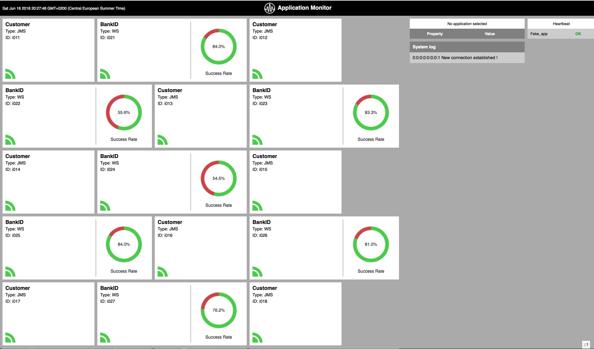

# Application Monitor
Monitor your applications easy using Application Monitor dash-board.
Send data to Application Monitor via UDP Server in JSON format described below.



## Requisites

* Gradle 2.3 +
* Java 1.7+
* Browser with HTML5 support

## Servers Ports

* UDP Server, default port 9090
* HTTP Server, default port 9000

## JSON Format

    {
    //MANDATORY FROM HERE
    "Id" : "i001",
    "Name" : "Customer",
    "Type" : "JMS",
    "Status" : "OK",

    //DATA TO MONITOR "OPTIONAL" FROM HERE
    "data":
    [
    { "name" : "msgRecv", "value" : "1", "type" : "T" },
    { "name": "msgSend", "value" : "5", "type" : "C" },
    { "name": "Errors", "value" : "${rannum}", "type" : "V" },
    { "name": "ErrorXSLT", "value" : "true", "type" : "B" },
    { "name": "LastError", "value" : "NO ERRORS", "type" : "S" }
    ]
    }


Type | Description
-----|-------------
C | Counter
V | Value
T | TPS
S | String


## Heartbeat JSON Format

    {
    //MANDATORY
    "AppId" : "app01",
    "AppName" : "BankID Integration",
    // Seconds Time To Wait
    "ttw" : "60"

    }

## Heartbeat JSON Format to Webpage

    {
    "AppId" : "app01",
    "AppName" : "BankID Integration",
    "Status : "OK" / "NOK"    
    }

## Run from Gradle

### With default ports

```
gradle run
```
### Overriding ports

```
$ gradle run -DudpServer.port=8080 -DhttpServer.port=8000
```

## Compile Fat jar

```
$ gradle fatJar
```

## Run Fat jar

### With default ports

```
$ java -jar build/libs/application-monitor-all-1.0.jar
```

### Overriding ports

```

 $ java -DudpServer.port=8080 -DhttpServer.port=8000 -jar build/libs/application-monitor-all-1.0.jar

```

 ## Access Web page

 http://localhost:9000/monitor/index.html 

 ## Send test data

```
 $ cd TestClient

 $ groovy UDPClientHB.groovy
```
